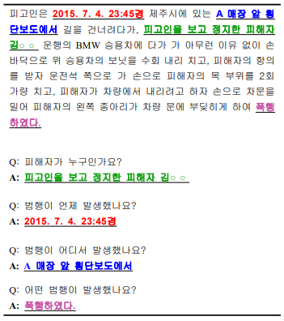
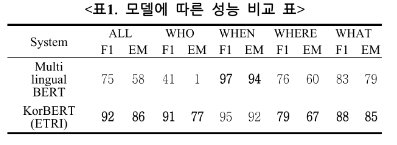
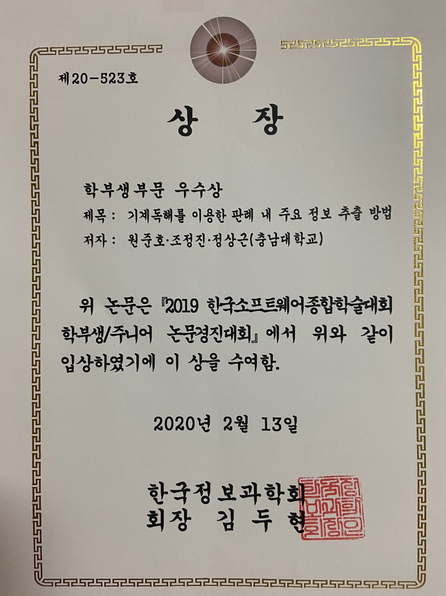

# AI law ([Paper](https://www.cseric.or.kr/literature/ser_view.php?))

판례 내에 있는 핵심 정보를 추출하는 인공지능 모델을 BERT를 이용하여 구현했고, 학습에 필요한 데이터셋을 정의하였다.<br/>
본 프로젝트에서 정의한 핵심 정보란 아래와 같다
* "누가 범죄를 저질렀는지"
* "언제 범죄를 저질렀는지"
* "어디서 범죄를 저질렀는지"
* "어떤 범죄를 저질렀는지"

정보를 추출하기 위해 기계독해 방식으로 문제에 접근하였고, 학습 데이터셋을 SQuAD 형식에 맞춰 태깅하였다.<br/>
판례 내에 있는 "범죄 사실"이라는 사건의 경위를 담고 있는 단락을 **context**로 하고,
추출하고자 하는 핵심 정보를 **question과 answer**을 통해 태깅했다.


Etri의 KorBERT와 구글의 Multilingual BERT를 사용하여 성능을 비교해봤고,<br/>
결과적으로 형태소 분석을 수행한 뒤 KorBERT를 통해 학습시키는 방법이 대부분의 상황에서 좋은 성능을 냈다.


## Dependencies
* torch>=1.7.0
* transformers>=4.0.0
* scikit-learn
* selenium
* xlrd
* xlsxwriter


## Dataset


<p align="center">
  
</p>

----


KorCL 데이터 셋을 구축하기 위해 법률정보통합검색 사이트인‘리걸서치’에서 성범죄 관련 판례 677건, 살인 관련 판례 46건, 폭행 관련 판례 278건으로 총 1,001건을 수집하였다. 
1,001건의 판례에 대한 질문으로는 WHO에 대한 질문 1,001개, WHEN에 대한 질문 975개, WHERE에 대한 질문 908개, WHAT에 대한 질문 1,001개로 총 3,885개의 질의응답쌍을 구축하였다


## How to Use

### Crawler
`python3 crawler/run_crawler.py`를 통해 [리걸서치 사이트](https://legalsearch.kr/)에서 판례 데이터를 크롤링할 수 있다.

현재 코드는 리걸서치에서 수집하고자 하는 키워드를 검색하였을 때, 검색되는 판례들만을 크롤링하도록 되어 있다. **만약, 다른 유형의 판례들도 수집하고 싶다면 main 함수의 `keywords` 리스트에 검색할 키워드를 입력하여 코드를 실행하면 된다.**

<br/>

### Model

### 1. preprocess data

```
python3 preprocess.py 
--input_file ../data/law.xlsx
--output_dir ../data/
```

data-processing 폴더 안에 있는 preprocess.py 실행시 excel 파일을 squad 데이터 형식의 데이터셋으로 변환된다.

* train.json : 70% data
* test.json : 30% data
* law.json  : 100% data


### 2. multilingual-BERT

``` 
python3 run_squad.py 
--model_type bert 
--model_name_or_path bert-base-multilingual-uncased 
--do_train 
--do_lower 
--do_eval 
--train_file ../../data/train.json 
--predict_file ../../data/test.json 
--per_gpu_train_batch_size 12 
--learning_rate 3e-5 
--num_train_epochs 2.0 
--max_seq_length 384 
--doc_stride 128 
--overwrite_output 
--overwrite_cache 
--output_dir ../../outputDir/multilingual/ 
--save_steps 5000 
--make_cache_file False
```

multilingualBERT/runningcode 폴더 안에 있는 run_squad.py 실행시 입력 인자로 받은 train_file을 이용하여 학습하고, predict_file로 모델 평가를 한다. <br/>
predict_file에 대한 f1 score와 exact match score를 결과로 출력창에 보여준다.

output_dir인 결과 폴더 안에는 예측 결과가 들어 있는 predictions.json,<br/>
fine tuning 을 거친 모델인 pytorch_model.bin 등이 생성된다.


### 3. ETRI-BERT

Etri의 KorBERT를 사용하기 위해서는 [이 사이트](http://aiopen.etri.re.kr/service_dataset.php)에서 사용허가협약서를 작성한 뒤 다운로드 받아야 한다.<br/>
pretrained model은 개인이 따로 공개할 수 없어 업로드하지 않겠지만, 모델을 다운받은 후 EtriBERT/ 폴더에 넣어주면 된다.


#### 3-1. 형태소 분석용 파일을 생성

```
python3 tokenizing.py
--openapi_key your key
--input_file ../../data/law.json 
--output_file ../../data/tokenizing.json
```

EtriBERT를 사용하기 위해서는 Etri에서 제공하는 형태소 분석 API를 사용하여 형태소 분석된 문장을 인풋으로 넣어줘야한다.<br/>
하지만 형태소 분석 API 호출은 하루 당 5000건으로 제한되어 있기에 API를 미리 호출시켜 학습 시 사용될 입력 문장을 형태소 분석된 문장으로 바꾼 뒤 파일인 tokenizing.json에 저장해야한다.

* 모든 데이터가 들어있는 law.json 파일을 불러와서 API호출 후 tokenizing.json 파일을 생성


#### 3-2. EtriBERT를 실행

```
python3 run_squad_ETRI.py 
--openapi_key `your key` 
--bert_model .. 
--train_file ../../data/train.json 
--predict_file ../../data/test.json 
--output_dir ../../outputDir/EtriBERT 
--tokenized_file ../../data/tokenizing.json 
--do_train 
--do_predict
```

EtriBERT 폴더 안에 있는 run_squad_ETRI.py 실행시 train_file을 학습시켜, test_file을 f1 score와 exact match score를 통해 평가한다.<br/>
결과 폴더 안에 예측 결과가 들어 있는 predictions.json과 점수가 들어있는 result.txt, fine tuning된 모델인 pytorch_model.bin가 생성된다.

> openapi_key는 etri API DATA 서비스 포털에서 발급 가능하다.<br/>
> 반드시 발급받은 후 key값을 넣어주어야 한다.

## Result

한국어만을 사용해 학습한 뒤 형태소 분석기를 사용한 Etri의 KorBERT가 Multilingual BERT에 비해 전체적으로 높은 성능을 보였다.



## Award

논문 이름 : [기계독해를 이용한 판례 내 주요 정보 추출 방법](https://www.cseric.or.kr/literature/ser_view.php?searchCate=literature&SnxGubun=INME&mode=total&SnxGubun=INME&gu=INME000F9&cmd=qryview&SnxIndxNum=214256&rownum=1&f1=MN&q1=Junho%20Won)


